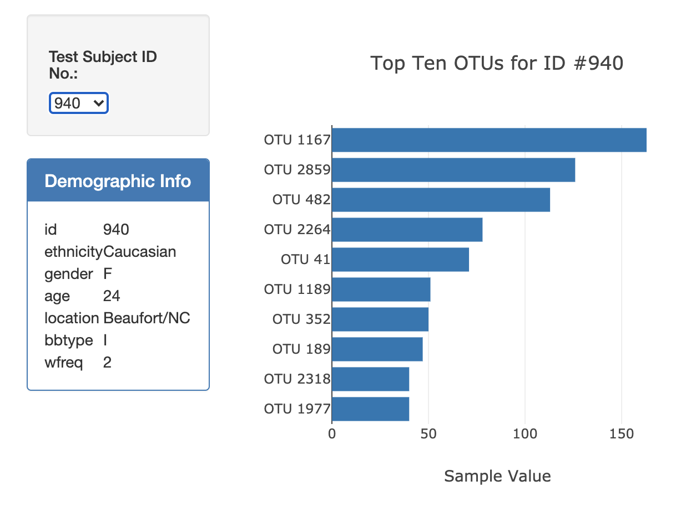
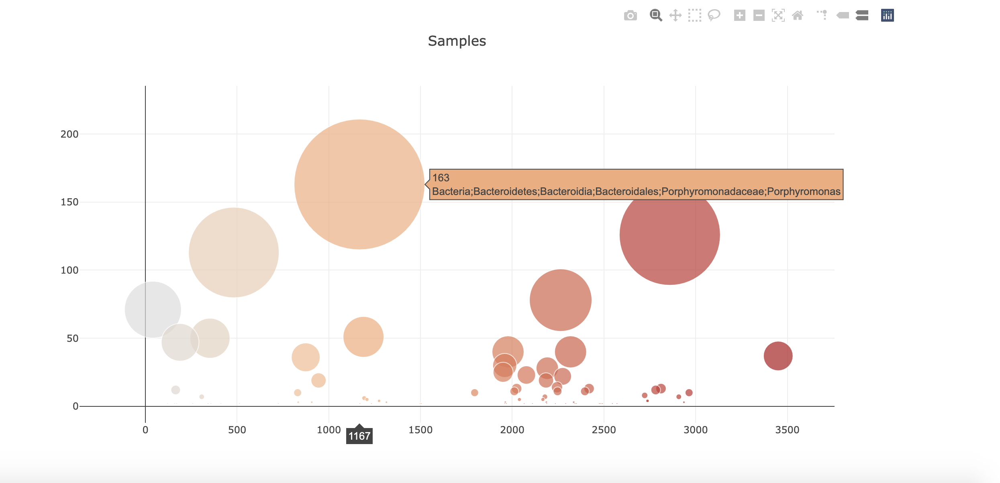

# Plotly - Belly Button Biodiversity Dataset

## Project Summary

* The goal of this project was to create an interactive dashboard out of a Belly Button Biodiversity dataset with the following elements:
  * A dropdown menu where samples could be selected
  * A bar chart displaying the top ten OTUs (operation taxonomic units) for the selected sample
  * A bubble chart displays information for the selected sample

## Technologies Used

* JavaScript - Plotly, D3
* HTML
* CSS
* Bootstrap

## The Process

* Various functions were created to: initialize the webpage, update the webpage based on sample selection, create charts, and build metadata.
* Filtering was an important part of the process, as it provided specific information for the selected sample.
* The bar chart was created by extracting the data from the json file. Then, slicing was used to retrieve the top ten OTUs. Lastly, Plotly was used to create the charts.
* The bubble chart was created by using the same extracted data that was used for the bar chart creation. Plotly was used to create the bubble chart.

## The Final Product: An Interactive Website
* Bar Plot and Demographics Table:
 
* Bubble Chart (demonstrating interactive data feature - hovering over bubble would display detailed information):
 
* [Deployment Link](https://chanrce.github.io/plotly-challenge/)
